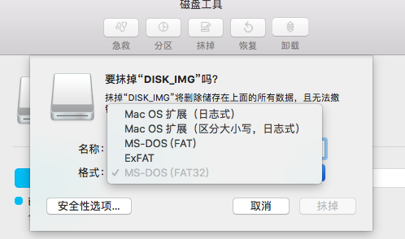

### 【Mac terminal 修改Git Config】
#### 问题：之前旧的Git账号不用了，新注册了一个Git账号，需要修改。
#### 解答：
```shell
$ git config --list 查看配置
$ git config --global user.name [username] 修改用户名
$ git config --global user.email [email]   修改邮箱
$ git config --global --unset user.name [username] 删除用户名
$ git config --global --unset user.email [email] 删除邮箱
```

### 【Mac 抹掉磁盘选项】
#### 问题：USB抹掉时如何选择
#### 解答：



* windows下通常格式为 NTFS，想要兼容Mac，选择FAT32 
* MS-DOS (FAT)：如果磁盘的大小为 32 GB 或不足 32 GB 时，选取此项
* ExFAT：如果磁盘的大小超过 32 GB 时，选取此项
* Mac OS 扩展（日志式）：使用 Mac 格式（日志式 HFS Plus）来保护分层文件系统的完整性
* Mac OS 扩展（区分大小写，日志式）：使用 Mac 格式并区分文件夹名称的大小写。例如，名称为“Homework”和“HOMEWORK”的文件夹是两个不同的文件夹。


### 【git 常用命令】

##### Git global setup:

* git config --global user.name "tzss86"
* git config --global user.email "tzss86@gmail.com"

##### Create Repository

* mkdir test
* cd test
* git init
* touch README
* git add README
* git commit -m 'first commit'
* git remote add origin git@github.com:tzss86/test.git
* git push -u origin master

##### Existing Git Repo?

* cd existing_git_repo
* git remote add origin git@github.com:tzss86/test.git
* git push -u origin master 

##### Branchs

* show local and remote branch :git branch -a 
* fetch remote branch: git fetch origin dev(dev is another branch on remote)
* switch master to dev (first time): git checkout -b dev
* switch master to dev :git checkout dev

##### clone remote branch dev2

* clone remote dev branch : git clone -b dev2 https://xxxxxx

##### create new local branch dev3

* add local new branch: git branch dev3
* switch to dve3 : git checkout dev3
* modify some code and add/commit
* git remote add dev3 https://github.com/tzss86/notes.git
* push to remote : git push origin dev3
* pull : git pull origin dev3

##### operation

* 放弃本地修改某文件：reset modify
: git checkout -- `<file>...`
* 撤销本地添加：reset add
: git reset HEAD `<file>`
* 撤销本地提交（还没有push到远端）：reset commit 
: git reset --hard commit_id

* commit_id 用：git log 查看最近的提交

* git status
* git add --all
* git commit -m 'xxx'
* git pull origin master
* git push origin master

### 【MongoDB 常用命令】

##### mongodb backup

* 备份（导出）export db：
* C:\Program Files\MongoDB\Server\3.2\bin>mongodump -h localhost -d dbName -o D:\Work\data\

* 还原（导入）import db：
* C:\Program Files\MongoDB\Server\3.2\bin>mongorestore -h localhost -d dbName --dir D:\Work\data\dbName

* 先删除本地再导入：delete local db and import db: 
* D:\Program Files\MongoDB\Server\3.2\bin>mongorestore -h localhost -d dbName --drop --dir D:\Work\data\dbName

* 导出单个集合：export single collection：
* C:\Program Files\MongoDB\Server\3.2\bin>sudo mongoexport -h localhost -d dbName -c collectionName -o D:\Work\data\collectionName.metadata.json

* 导入单个集合 import single collection： 
* C:\Program Files\MongoDB\Server\3.2\bin>mongoimport -h localhost -d dbName -c collectionName D:\Work\data\collectionName.metadata.json

* 导入单个BSON：import BSON ：
* C:\Program Files\MongoDB\Server\3.2\bin>mongorestore -h localhost -d dbName D:\Work\data\collectionName.bson

##### mongodb operation

* C:\Program Files\MongoDB\Server\3.2\bin>mongo
* show dbs
```
XXX   0.000GB
Dev   0.550GB
XXX   0.800GB
```

* use Dev
```
switched to db Dev
```

* db
```
Dev
```

* show collections
* db.mall.ticket.order.logs.find()  //默认20条

##### 错误记录：
* sort 数据量大于32M 报错

>(node:8312) UnhandledPromiseRejectionWarning: Unhandled promise rejection (rejection id: 1): 
MongoError: Executor error during find command: OperationFailed:
 Sort operation used more than the maximum 33554432 bytes of RAM. Add an index, or specify a smaller limit.

* 验证：
```
> db.mall.ticket.order.logs.find({"adminUserId" : ObjectId("59ee998ebf40ad728a36ec6a")}).sort({ createdAt: -1 })
```

* 结果：
```
Error: error: {
        "waitedMS" : NumberLong(0),
        "ok" : 0,
        "errmsg" : "Executor error during find command: OperationFailed: Sort op
eration used more than the maximum 33554432 bytes of RAM. Add an index, or specify a smaller limit.",
        "code" : 96
}
```

* 解决办法：一、修改mongodb 默认设置
```
> db.adminCommand({setParameter:1,internalQueryExecMaxBlockingSortBytes:335544320}) 扩大内存分配320M。不推荐
```

* 解决办法：二、Add an index 修改后不再报错
```
> db.mall.ticket.order.logs.createIndex({createdAt:-1})
{
        "createdCollectionAutomatically" : false,
        "numIndexesBefore" : 1,
        "numIndexesAfter" : 2,
        "ok" : 1
}

> db.mall.ticket.order.logs.getIndexes()
[
        {
                "v" : 1,
                "key" : {
                        "_id" : 1
                },
                "name" : "_id_",
                "ns" : "PositionSystem.mall.ticket.order.logs"
        },
        {
                "v" : 1,
                "key" : {
                        "createdAt" : -1
                },
                "name" : "createdAt_-1",
                "ns" : "PositionSystem.mall.ticket.order.logs"
        }
]
```


* 解决办法：三、对于日志记录等数据量大的，还是需要进行二次处理（例如：合并）与分页查询优化，共给前端的数据API读取处理后的结果。（根据项目实际情况具体实施）


